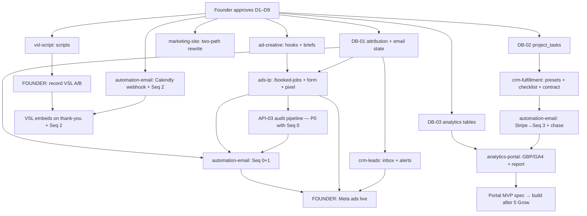

# Master Execution Plan — New Legacy AI

**Version 1.0 · August 22, 2026 · Maintained by master agent**

**Status: ✅ D1–D9 APPROVED August 22, 2026.** D2 amendment: no dollar amount on `/booked-jobs`. Wave 1 unblocked.

Companion docs: `HORMOZI-CRITIQUE-RESULTS.md` (why) · this file (what/when/who) · existing four strategy docs (background).

---

## Table of contents

1. [Approved strategy summary](#1-approved-strategy-summary)
2. [Multi-agent architecture](#2-multi-agent-architecture)
3. [A — Build inventory](#3-a--build-inventory)
4. [B — 90-day sprint plan](#4-b--90-day-sprint-plan)
5. [C — Unit economics tracker](#5-c--unit-economics-tracker)
6. [D — Ad content plan](#6-d--ad-content-plan)
7. [E — Main site change spec](#7-e--main-site-change-spec)
8. [F — Email + VSL wiring spec](#8-f--email--vsl-wiring-spec)
9. [Founder-only checklist](#9-founder-only-checklist)
10. [Start here Monday](#10-start-here-monday)

---

## 1. Approved strategy summary

Approve in [`FOUNDER-APPROVAL-CARD.md`](FOUNDER-APPROVAL-CARD.md). Compact:

- **D1** Paid = Meta → `/booked-jobs` only · cold + demo killed · warm asks required
- **D2** One LP offer (Launch). **No price on the page.** $2,997 in VSL A + on the call. Fix/plan on-call only. After 5 clients: $3,497
- **D3** Build audit automation (API-03 P0). Seq 0 = their PDF + generic VSL A + book. VSL B only after they book. Spec: `AUDIT-AND-VSL-FUNNEL-SPEC.md`
- **D4** $1,997 minimum before work · Grow pitched Day 14, billed Day 30
- **D5** <60 sec automated speed-to-lead
- **D6** One avatar: Ontario HVAC / plumber / electrician / roofer (not detailers)
- **D7** VA-only hiring, after 2nd Launch/mo
- **D8** Contract 14 days + capture language · CRM preset $2,997 · site two-path
- **D9** **$3k cash plan:** floor $2,000 · max $600 Meta before first sale · $15–20/day · after sale #1 put $1,000–1,200 back into ads · $100/day only after sale #3 or $8k cash

---

## 2. Multi-agent architecture

### Master agent (this model)

| Responsibility | Detail |
|----------------|--------|
| Final architecture | Owns route/table/naming decisions; resolves merge conflicts between subagent outputs |
| Hormozi validation | Every deliverable checked against D1–D9 before it becomes a build ticket |
| Approval gate | No subagent output merges without master review + founder sign-off on copy/pricing/legal items |
| This document | Maintains `docs/MASTER-EXECUTION-PLAN.md` — status column updated per sprint |
| Founder interface | Maintains §9 founder checklist; surfaces blockers weekly |

### Subagent roster

| Agent | Scope | Inputs | Outputs | Model tier |
|-------|-------|--------|---------|-----------|
| **marketing-site** | Main site two-path rewrite | E-spec (§7), existing components | Edited `HeroSection.tsx`, `ServicesScroll.tsx`, `marketing-nav.ts`, `layout.tsx`, `HomePage.tsx` | Mid (frontend, tight spec) |
| **ads-lp** | `/booked-jobs` siloed funnel | D-spec (§6), design system doc, `website_leads` schema | LP route, form, thank-you + VSL embed, Pixel/CAPI, noindex | High (conversion-critical) |
| **crm-fulfillment** | Delivery tooling | Fulfillment Playbook §5/§12/§15, contract template | Package presets, 14-day checklist, contract update, QA checkboxes, demo-flow removal | Mid |
| **crm-leads** | Lead ops | `034_website_leads.sql`, LP form fields | Leads inbox UI, attribution columns, speed-to-lead alerts | Mid |
| **automation-email** | Sequences 0–5 + webhooks | Ops Plan §5, Resend function, n8n flow | Templates, sequence engine, Calendly/Stripe webhook handlers | High (state machine + idempotency) |
| **analytics-portal** | Reporting | Ops Plan §1–3, GBP/GA4 API docs | API integrations, snapshot cron, report template, portal MVP **spec** | High (OAuth, external APIs) |
| **ad-creative** | Meta copy assets | §6 hook list, Scaling Playbook §7 | 20+ hooks, Hook-Meat-CTA matrix, per-trade briefs, retargeting brief | High (copy quality = CAC) |
| **vsl-script** | Teleprompter scripts | Ops Plan §6 beat sheets, case-study stats | Word-for-word VSL A/B scripts + VSL C cut list | High (copy quality) |

### Per-agent specs

#### marketing-site
- **Files:** `src/components/marketing/HeroSection.tsx`, `src/components/marketing/ServicesScroll.tsx`, `src/lib/marketing-nav.ts`, `src/app/(marketing)/layout.tsx`, `src/components/marketing/HomePage.tsx` (anchor ids)
- **Acceptance:** Hero shows 3 two-path beats per §7 copy; six AI cards replaced by two path cards + "more capabilities" link; nav matches §7 (no `/booked-jobs` link); metadata updated; galaxy visuals, case studies, industries page untouched; no lead-answering language anywhere; builds clean.
- **Depends on:** D8 approval, final copy sign-off. **Effort:** 10h.

#### ads-lp
- **Files (new):** `src/app/(marketing)/booked-jobs/page.tsx`, `.../booked-jobs/thank-you/page.tsx`, `src/components/marketing/booked-jobs/*` (hero, stack, proof, process, FAQ, form), `src/lib/meta-capi.ts`
- **Acceptance:** `robots: noindex`; not in nav/sitemap/footer; headline swaps via `?h=` slug (§6 match rules); form fields per Scaling Playbook §8 incl. "$2,500+ ready?"; submit inserts `website_leads` with `source='booked-jobs'` + UTM; **above the fold: hook + one CTA (form or watch), no competing nav/logo pull**; sticky “Book 15-min” bar on first scroll; thank-you is the **wait room** (VSL A autoplay-safe + Calendly + “PDF in ~5 min”); Pixel PageView/Lead + CAPI; <2s mobile LCP; one offer (Launch), **no dollar amount on the page**; tap-to-call as second path; founder walks the live funnel once before ads (expect something broken). No “reserve your seat” wording.
- **Depends on:** D2/D6 approval, DB-01, AD-01 (headline slugs), VSL A recorded (embed can be placeholder until then). **Effort:** 25h.

#### crm-fulfillment
- **Files:** `project-contracts-panel.tsx` (presets), `src/lib/onboarding/contract-template.ts`, new `src/app/(main)/projects/[id]/checklist/`, `supabase/migrations/042_project_tasks.sql`, `src/app/api/webhooks/no-answer/route.ts` (demo email removal)
- **Acceptance:** One-click presets: Launch $2,997 / Fix $1,197 (legacy $1,700 default gone); contract says 14 days from payment+onboarding with delay-pause clause + capture-not-answer clause + Grow report scope; Stripe payment on a Launch preset auto-creates the 14 tasks from Fulfillment §12 with day offsets + QA checkboxes from §15; demo-site email deleted (route removed or repurposed to audit email).
- **Depends on:** D8, DB-02, API-02 (task auto-create trigger). **Effort:** 19h.

#### crm-leads
- **Files (new):** `src/app/(main)/website-leads/page.tsx` + components; `supabase/migrations/041_lead_attribution.sql` (utm_source/medium/campaign/content, headline_variant, `lead_email_state`)
- **Acceptance:** Inbox lists `website_leads` newest-first with status, qualification answers, UTM, sequence state; status editable; new lead triggers owner SMS (Twilio) + email <60 sec; lead detail shows full journey (form → emails sent → booked → paid).
- **Depends on:** DB-01, Twilio env (founder). **Effort:** 13h.

#### automation-email
- **Files (new):** `src/app/api/webhooks/calendly/route.ts`, extend `src/app/api/webhooks/stripe/route.ts`, `src/lib/email/templates/*` (seq 0–5), `src/lib/email/sequence-engine.ts`, `supabase/migrations/041` (shares `lead_email_state`), cron route `src/app/api/cron/sequences/route.ts`
- **Acceptance:** Seq 0 instant on lead insert; Seq 1 days 1–6 via cron with stop conditions (booked/paid/unsubscribed); Calendly `invitee.created` (signature verified) → Seq 2 + status `booked`; Stripe invoice paid → Seq 3 Day 0 + project/checklist creation; asset-chase days 1/2/3 keyed off onboarding incompleteness; Seq 4 monthly cron; Seq 5 Day 45; all sends idempotent (one row per lead per step); unsubscribe honored.
- **Depends on:** DB-01, API keys (founder), CRM-05 for Seq 3 milestone triggers. **Effort:** 29h.

#### analytics-portal
- **Files (new):** `supabase/migrations/043_analytics_connections.sql` (`client_analytics_connections`, `client_analytics_snapshots`), `src/lib/analytics/gbp.ts`, `src/lib/analytics/ga4.ts`, cron `src/app/api/cron/analytics-snapshot/route.ts`, `src/lib/reports/monthly-report.ts`, `docs/PORTAL-MVP-SPEC.md`
- **Acceptance:** GBP Performance API pulls the 8 metrics from Ops Plan §2 with stored refresh token per client; GA4 Data API pulls sessions/`generate_lead`/`click_call`; weekly snapshot cron; monthly report generator produces the 5-part format (headline number, 3 bullets, screenshot slot, 1 recommendation, CTA) as HTML→PDF; portal spec documents `/portal/[token]` 4-card + chart MVP (build deferred until 5+ Grow clients per Ops Plan §3).
- **Depends on:** DB-03, Google Cloud OAuth creds (founder), ≥1 live client for real data. **Effort:** 25h (spec 3h of that).

#### ad-creative
- **Files (new):** `docs/ads/META-HOOKS-TRACK-A.md`, `docs/ads/CREATIVE-BRIEFS.md`, `docs/ads/RETARGETING-BRIEF.md`
- **Acceptance:** ≥20 hooks covering plumber/HVAC/detailer/electrician/roofer × Ontario (§6 seed list expanded); each hook mapped to LP `?h=` slug; 4 body variants per Hook-Meat-CTA matrix; per-trade static-image briefs (visual, overlay text, aspect ratios 1:1/4:5/9:16); retargeting brief for VSL C; zero hooks promising lead answering, rankings, or job guarantees; conceptually distinct concepts (not headline swaps) per Andromeda guidance.
- **Depends on:** D6 approval. No code deps — **can start immediately.** **Effort:** 11h.

#### vsl-script
- **Files (new):** `docs/vsl/VSL-A-SCRIPT.md`, `docs/vsl/VSL-B-SCRIPT.md`, `docs/vsl/VSL-C-CUTLIST.md`
- **Acceptance:** Word-for-word teleprompter scripts (not beat sheets) expanding Ops Plan §6: VSL A 750–1,100 words (5–8 min), VSL B 450–650 words; screen-record B-roll shot list (GMB map pack, ShowRoom before/after) with timestamps; offer stack anchors ~$5,100 → $2,997; capture-not-answer language verbatim in FAQ section; 72h booking scarcity in CTA; VSL C cut list references VSL A timestamps.
- **Depends on:** D2 approval. No code deps — **can start immediately.** **Effort:** 6h.

### Report format (all subagents → master)

```markdown
## [agent] report — [date]
**Tickets:** [IDs from build inventory]
**Status:** complete | blocked | partial
**Files changed:** [paths]
**Acceptance criteria:** [each criterion: ✅/❌ + evidence (test, screenshot, build output)]
**Deviations from spec:** [what + why, or "none"]
**New dependencies/env vars introduced:** [list, or "none"]
**Open questions for master:** [list, or "none"]
```

Master merges only when all criteria ✅ and deviations approved.

### Dependency graph



### Execution order

| Wave | Parallel work | Gate to next wave |
|------|--------------|-------------------|
| **0** | Founder approves D1–D8 | Approval |
| **1 (parallel)** | ad-creative · vsl-script · marketing-site · DB-01/02/03 migrations | Hooks + scripts approved by master |
| **2 (parallel)** | ads-lp · crm-leads · **API-03 audit pipeline** · Seq 0 (PDF+VSL A) · Calendly + VSL B · founder records both VSLs | LP live; form → scrape → reviewed PDF → email/SMS with VSL A + book |
| **3** | **Meta discovery $15–20/day** · crm-fulfillment (presets, checklist, contract, demo-kill) | Ads say “free audit” only after API-03 is live |
| **4 (parallel)** | Stripe→Seq 3 + asset chase · sales SOP | First client paid |
| **5** | analytics-portal (GBP/GA4, report template) · Seq 4/5 | First Grow client |
| **6** | Portal build (only if 5+ Grow clients) | — |

---

## 3. A — Build inventory

Every incomplete item. Covers SESSION-HANDOFF §4 in full plus critique additions (marked ✚).

| ID | Deliverable | Type | Files / routes | Agent | Hrs | Depends on | Pri |
|----|-------------|------|----------------|-------|-----|------------|-----|
| **Marketing main site** | | | | | | | |
| MS-01 | Hero two-path rewrite (3 beats, §7 copy) | Frontend | `HeroSection.tsx` | marketing-site | 3 | D8 | P1 |
| MS-02 | ServicesScroll → two path cards | Frontend | `ServicesScroll.tsx` | marketing-site | 4 | D8 | P1 |
| MS-03 | Nav update (no LP link) | Frontend | `marketing-nav.ts` | marketing-site | 1 | MS-02 | P1 |
| MS-04 | Metadata rewrite | Frontend | `(marketing)/layout.tsx` | marketing-site | 0.5 | D8 | P1 |
| MS-05 | HomePage anchors `#local` `#custom` | Frontend | `HomePage.tsx` | marketing-site | 1.5 | MS-02 | P1 |
| **Ads LP /booked-jobs** | | | | | | | |
| LP-01 | LP page (hero/pain/stack/proof/process/FAQ), noindex | Frontend | `(marketing)/booked-jobs/page.tsx` + components | ads-lp | 10 | AD-01 | P0 |
| LP-02 | Qualification form → `website_leads` + UTM | Full-stack | form component, `api/lead` reuse | ads-lp | 4 | DB-01 | P0 |
| LP-03 | Thank-you wait room: VSL A + Calendly + “audit in ~5 min” | Frontend | `booked-jobs/thank-you/page.tsx` | ads-lp | 4 | LP-01, API-03 | P0 |
| LP-04 | Meta Pixel + CAPI (PageView/Lead/Schedule) | Full-stack | LP + `src/lib/meta-capi.ts` | ads-lp | 5 | LP-02, F-09 | P0 |
| LP-05 | `?h=` headline variant support | Frontend | LP hero | ads-lp | 2 | LP-01 | P0 |
| **CRM features** | | | | | | | |
| CRM-01 | `website_leads` inbox UI | Frontend | `(main)/website-leads/` | crm-leads | 6 | DB-01 | P0 |
| CRM-02 | Lead detail + journey/attribution view | Frontend | same | crm-leads | 3 | CRM-01 | P1 |
| CRM-03 | Speed-to-lead owner alert (SMS+email <60s) ✚ | Backend | lead insert trigger / route | crm-leads | 4 | DB-01, F-03 | P0 |
| CRM-09 | VSL B watch-check: inbound SMS `READY` → `vsl_b_confirmed_at` + inbox badge | Backend | Twilio inbound webhook | crm-leads | 3 | DB-01, F-03 | P0 |
| CRM-04 | Package presets ($2,997 Launch; kill $1,700) | Frontend | `project-contracts-panel.tsx` | crm-fulfillment | 3 | D8 | P0 |
| CRM-05 | 14-day checklist (auto-tasks on payment) | Full-stack | `projects/[id]/checklist/`, API-02 | crm-fulfillment | 8 | DB-02, API-02 | P1 |
| CRM-06 | Contract: 14 days + capture language + Grow scope | Backend | `contract-template.ts` | crm-fulfillment | 3 | D8, F-07 | P1 |
| CRM-07 | QA "test passed" checkboxes (§15 gates) ✚ | Frontend | checklist UI | crm-fulfillment | 2 | CRM-05 | P2 |
| CRM-08 | Kill demo-site flow (no-answer email, statuses) ✚ | Cleanup | `api/webhooks/no-answer`, calling statuses | crm-fulfillment | 3 | D1 | P0 |
| **Supabase migrations** | | | | | | | |
| DB-01 | 041: UTM cols + `headline_variant` + `lead_email_state` + `vsl_a_confirmed_at` | Migration | `supabase/migrations/041_*.sql` | crm-leads | 2 | approval | P0 |
| DB-02 | 042: `project_tasks` | Migration | `042_*.sql` | crm-fulfillment | 2 | approval | P1 |
| DB-03 | 043: analytics connections + snapshots | Migration | `043_*.sql` | analytics-portal | 2 | approval | P1 |
| **API routes / webhooks** | | | | | | | |
| API-01 | Calendly inbound webhook (signed) | Backend | `api/webhooks/calendly/route.ts` | automation-email | 4 | F-04 | P0 |
| API-02 | Stripe paid → project + tasks + Seq 3 | Backend | extend `api/webhooks/stripe/route.ts` | automation-email | 5 | DB-02 | P1 |
| API-03 | Audit pipeline: scrape self+3 competitors → score → PDF → Seq 0 | Backend | `api/audit/generate/route.ts`, expand scraper fields | automation-email + scraper | 14 | LP-02 | **P0** |
| **Email automation** | | | | | | | |
| EM-01 | Seq 0: audit PDF + VSL A + book (one email) | Backend | sequence engine + template | automation-email | 4 | DB-01, API-03 | P0 |
| EM-02 | Seq 1 6-day nurture (cron, stop conditions) | Backend | `api/cron/sequences/` | automation-email | 8 | EM-01 | P0 |
| EM-03 | Seq 2 pre-call (instant/24h/2h) | Backend | via API-01 | automation-email | 3 | API-01 | P0 |
| EM-04 | Seq 3 onboarding 14-day + asset chase D1/2/3 | Backend | via API-02 + onboarding state | automation-email | 6 | API-02 | P1 |
| EM-05 | Seq 4 monthly + Seq 5 referral D45 | Backend | cron | automation-email | 3 | EM-04 | P2 |
| EM-06 | Email templates seq 0–5 (copy from Ops Plan §5) | Content | `src/lib/email/templates/` | automation-email | 6 | approval | P0 |
| **Analytics / portal** | | | | | | | |
| AN-01 | GBP Performance API integration | Backend | `src/lib/analytics/gbp.ts` | analytics-portal | 8 | DB-03, F-08 | P1 |
| AN-02 | GA4 Data API integration | Backend | `src/lib/analytics/ga4.ts` | analytics-portal | 6 | DB-03, F-08 | P1 |
| AN-03 | Monthly report template + AI narrative | Backend | `src/lib/reports/` | analytics-portal | 5 | AN-01/02 | P1 |
| AN-04 | Snapshot cron (weekly) | Backend | `api/cron/analytics-snapshot/` | analytics-portal | 3 | AN-01/02 | P2 |
| AN-05 | Portal `/portal/[token]` MVP **spec** | Doc | `docs/PORTAL-MVP-SPEC.md` | analytics-portal | 3 | AN-03 | P2 |
| **Ad creative (copy only)** | | | | | | | |
| AD-01 | 20+ hooks, 5 trades × Ontario | Copy | `docs/ads/META-HOOKS-TRACK-A.md` | ad-creative | 4 | D6 | P0 |
| AD-02 | Hook-Meat-CTA matrix (4 bodies) | Copy | same | ad-creative | 3 | AD-01 | P0 |
| AD-03 | Per-trade creative briefs | Copy | `docs/ads/CREATIVE-BRIEFS.md` | ad-creative | 3 | AD-01 | P0 |
| AD-04 | Retargeting brief (VSL C) | Copy | `docs/ads/RETARGETING-BRIEF.md` | ad-creative | 1 | VSL-03 | P1 |
| AD-05 | Cursor ads-optimizer skill (winners/losers → next hooks). Not Claude Code. Needs 10+ live ads + real spend. Hyros optional later. | Doc + skill | `.cursor/skills` or `docs/ads/OPTIMIZER-SKILL.md` | ad-creative | 8 | sale #2, Meta export | **P2** |
| **VSL scripts (not recording)** | | | | | | | |
| VSL-01 | VSL A script (generic; Jay+ShowRoom proof; sells the call) | Copy | `docs/vsl/VSL-A-SCRIPT.md` | vsl-script | 3 | D2, D6 | P0 |
| VSL-02 | VSL B teleprompter script | Copy | `docs/vsl/VSL-B-SCRIPT.md` | vsl-script | 2 | VSL-01 | P0 |
| VSL-03 | VSL C cut list | Copy | `docs/vsl/VSL-C-CUTLIST.md` | vsl-script | 1 | VSL-01 | P1 |
| **Documentation / SOP** | | | | | | | |
| DOC-01 | Sales call SOP skeleton (script, objections, Grow pitch) ✚ | Doc | `docs/SALES-CALL-SOP.md` | master + founder | 2 | D4/D7 | P1 |
| DOC-02 | Purge demo-site/parallel-cold refs from 4 strategy docs ✚ | Doc | changelog entries | master | 2 | D1 | P1 |
| DOC-03 | VA monthly-report + GMB SOP | Doc | `docs/VA-SOP.md` | master | 1 | AN-03 | P2 |

**Total: ~170 h** (≈115 h agent-executable code, ~25 h copy/docs, remainder integration/QA).

---

## 4. B — 90-day sprint plan

Definition of done (DoD) = acceptance criteria in §2 + master review passed.

| Wk | Ships | Agent(s) | DoD / metric |
|----|-------|----------|--------------|
| **1** | D1–D9 approved · AD-01/02/03 · VSL-01/02/03 · DB-01/02/03 · MS-01..05 | founder, ad-creative, vsl-script, marketing-site, crm-leads | Hooks+scripts founder-approved; migrations applied; main site two-path live. Founder: 10 warm asks · Meta BM + $20/day *cap* (do not turn spend on yet) · Twilio · env vars |
| **2** | LP-01..05 · CRM-01/03 · **API-03** · EM-01/06 · API-01/EM-03 | ads-lp, crm-leads, automation-email | Form → scrape → PDF (2-min review) → Seq 0 with VSL A + book. Founder records VSL A+B in one session |
| **3** | VSL embeds · EM-02 · CRM-08 · Pixel/CAPI QA · **Meta discovery $15–20/day, 4–5 ads** | ads-lp, automation-email, founder | Events verified; demo flow dead; **account spend cap $600**. 10 warm asks done |
| **4** | CRM-04 · CRM-06 · DOC-01 · watch D9 kill rules | crm-fulfillment, master | Preset + contract live. Pause if $400 spent / 0 booked calls. First calls from ads *or* warm |
| **5** | API-02 · EM-04 · CRM-05 | automation-email, crm-fulfillment | Paid → project + 14 tasks + Seq 3. Target: **1st Launch** (warm or paid) |
| **6** | After sale #1: **reinvest $1,000–1,200 (~$40/day)** · audit already live — iterate rubric | founder, automation-email | Cash floor reset; COGS $500 reserved from the invoice. CPQL ≤$200 at this volume |
| **7** | Creative iteration (swap 2 losers, keep winners) · CRM-07 | ad-creative, crm-fulfillment | Client #1 on checklist; do not add trades/geo yet |
| **8** | AN-01/02 start · DOC-02 | analytics-portal, master | GBP/GA4 for client #1. Sale #2 pace → VA trigger |
| **9** | AN-03 report template · EM-05 | analytics-portal, automation-email | First monthly report from real data. VA only if 2 Launch in one month |
| **10** | Optional 15% retarget **only if** pixel has volume; else skip | founder + ad-creative | Skip retarget if <500 LP views — waste at this spend |
| **11** | AN-04 · DOC-03 · Day-14 Grow pitch | analytics-portal, founder | Client #1 launched on time |
| **12** | Creative r2 · sales SOP from recordings | ad-creative, founder | If sale #2 landed: raise to $50–75/day |
| **13** | 90-day review · AN-05 · $100/day decision | master | $100/day only if sale #3 or cash ≥ $8k |

---

## 5. C — Unit economics tracker

**Starting cash: $3,000. D9 budget — not $100/day.**

Assumptions: discovery $20/day from ~Day 15 until first sale or $600 cap; if sale #1 lands, reinvest $1,200 (~$40/day). Warm/referral can produce a sale with $0 CAC. COGS/Launch ~$500 funded from the invoice. Grow $497 pitched Day 14, billed Day 30.

| Metric | Month 1 | Month 2 | Month 3 | Notes |
|--------|---------|---------|---------|-------|
| Meta spend | $400–600 | $1,200 | $1,500–2,000 | Only if sale #1 happened; else $0 after pause |
| Starting cash (month end, if 0 then 1 then 2 sales) | ≥$2,000 if no sale | ≥$3,500 if 1 sale | ≥$5,000 if 2 sales | Floor never broken |
| Leads (paid, @ ~$55 CPL) | 7–11 | 20 | 27–36 | Low volume — noisy |
| Warm intros asked / booked | 10 / 1–2 | 5 / 1 | 5 / 1 | **Required M1** |
| **Launch sales (plan)** | **0–1** | **1–2** | **1–2** | 3–5 in 90 days if mixed; 1–3 if paid-only |
| Launch revenue | $0–2,997 | $2,997–5,994 | $2,997–5,994 | PIF |
| **CAC if 1 sale on $600** | **$600** | — | — | 2×($600+$500)=$2,200 vs GP $2,497 = **1.13×** (passes without Grow) |
| **30-day ratio w/ Grow** | **1.36×** | improves | improves | Day-14 pitch |
| VA trigger | — | only if 2 Launch in 1 mo | possible | Do not hire on hope |

**Cash walk-forward (paid-only, worst case we model)**

| Step | Cash after | Ads this step |
|------|------------|---------------|
| Start | $3,000 | $0 |
| Discovery (max) | $2,400 | $600 |
| Sale #1 collected | $5,397 | — |
| Delivery COGS | $4,897 | −$500 from invoice |
| Reinvest reserved | $3,697 | $1,200 at ~$40/day |

If sale #1 is **warm**: keep discovery at $0–300; cash after close is ~$5,500 before COGS.

**Kill criteria (D9):** $400 spent / 0 booked calls → pause. $600 spent / 0 sales → pause, rework LP/hooks. **Do not raise spend to “make learning work.”** $100/day only after sale #3 or cash ≥ $8k.

---

## 6. D — Ad content plan (Track A)

### 20 hook lines (Ontario first)

| # | Trade | Hook | LP slug `?h=` |
|---|-------|------|---------------|
| 1 | Plumber | "If you're a plumber in Ontario still getting every job from word-of-mouth — read this before your slow season." | `plumber-wom` |
| 2 | Plumber | "The plumber who shows up first on Google Maps isn't better than you. He just shows up first." | `plumber-maps` |
| 3 | Plumber | "A homeowner with a burst pipe calls 3 plumbers. If you're voicemail, you're not one of them." | `plumber-voicemail` |
| 4 | Plumber | "Ontario plumbers: you're losing 3–5 jobs a month to guys with worse work and better Google reviews." | `plumber-reviews` |
| 5 | HVAC | "If your HVAC company doesn't show up when someone searches 'furnace repair near me' — this is why." | `hvac-search` |
| 6 | HVAC | "GTA HVAC owners: your busiest season is coming. Your Google listing isn't ready for it." | `hvac-season` |
| 7 | HVAC | "You missed a call on a ladder yesterday. That homeowner already booked your competitor." | `hvac-missedcall` |
| 8 | HVAC | "The HVAC companies winning on Google Maps aren't bigger. They just look bigger." | `hvac-lookbigger` |
| 9 | Detailer | "If you own a detailing business and your website looks like it was built in 2010, you're pricing yourself down." | `detail-2010` |
| 10 | Detailer | "Detailers: 500+ shops book jobs through systems we built. Yours still runs on DMs?" | `detail-dms` |
| 11 | Detailer | "The difference between $80 details and $300 details is usually the Google listing, not the work." | `detail-price` |
| 12 | Detailer | "You post your best work on Instagram. Customers search on Google. See the problem?" | `detail-google` |
| 13 | Electrician | "Ontario electricians: licensed, insured, 15 years experience — and invisible on Google Maps." | `elec-invisible` |
| 14 | Electrician | "Panel upgrades are $3k+ jobs. How many did voicemail cost you last month?" | `elec-panel` |
| 15 | Electrician | "Homeowners don't pick the best electrician. They pick the first one who looks legit and answers." | `elec-first` |
| 16 | Roofer | "Roofers: one job pays for your whole marketing year. You're still not on the map pack." | `roof-onejob` |
| 17 | Roofer | "Storm season sends homeowners to Google, not to your truck sign." | `roof-storm` |
| 18 | Roofer | "The roofer with 47 reviews gets the call. The roofer with 3 does the better work. Fix the gap." | `roof-reviews` |
| 19 | Multi-trade | "If you run a trade business in Ontario and missed calls go to voicemail — you're paying for your competitor's ads." | `trade-voicemail` |
| 20 | Multi-trade | "You're 2+ years in, good at the work, bad at Google. That's a solvable problem — in 14 days." | `trade-14days` |

### Body variants (Hook-Meat-CTA)

| Body | Meat | CTA |
|------|------|-----|
| **B1 Problem-agitate** | 3 pains: invisible on map pack → untrusted (review gap) → slow (voicemail = lost job). "The homeowner calls three names. You're number three. They never call back." | "Get your free Google visibility audit — see exactly where you're losing jobs." |
| **B2 Mechanism** | The Booked Jobs Launch System: Google profile that ranks + a site that converts in 3 seconds + missed-call text-back. **You still close the job — we make sure the lead reaches you.** Live in 14 days. | "Book a free 15-minute strategy call." |
| **B3 Proof-led** | ShowRoom before/after stat + "we build booking systems used by 500+ detailers." Screenshot creative. | "See what your Google listing is costing you — free audit." |
| **B4 Cost-of-inaction** | Math: 3 lost jobs/mo × avg ticket × 12 months. "That's not a marketing problem. That's a leak." | "Free audit shows the leak in 60 seconds." |

Canonical hook list: `docs/ads/META-HOOKS-TRACK-A.md` (rewritten to the 18/19/20 style). Discovery = hooks 1–5. No price in ads.

### LP headline match rules

- Ad clicked with `?h=plumber-maps` → LP H1 renders that hook's exact line; sub and form stay constant.
- Trade name in hook → trade pre-selected in form dropdown.
- Default (no param): "Stop losing jobs on Google Maps" + "Ontario HVAC, plumbers, electricians & roofers · 2+ years in business." No price on the page.
- UTM + `headline_variant` persist into `website_leads` for creative-level CAC reporting.

### Retargeting brief (VSL C)

- **Audience:** LP visitors 30d + ≥25% VSL A viewers, minus leads.
- **Creative:** VSL C 60–90s cut (Hook 10s → ShowRoom proof 15s → offer line → CTA 10s), founder on camera, captions on, 1:1 + 9:16.
- **Copy:** "Still losing jobs to the map pack? The audit is free. The call is 15 minutes."
- **Budget:** skip until ≥500 LP views or sale #2. At $20/day, retargeting is usually wasted.

### What NOT to run

- ❌ Traffic to main site (broad brand ≠ one avatar)
- ❌ Meta instant lead forms for cold traffic ($2.5k+ offer needs LP + VSL trust; lead-form cost/client ≈ $1,300 vs LP ≈ $400–650)
- ❌ Any hook promising "we answer your leads," rankings, or guaranteed job counts
- ❌ Multi-trade generic creative as the majority (hooks 19–20 are tests, ≤20% of spend)
- ❌ US geo or new trades before one Ontario hook produces 2+ clients

---

## 7. E — Main site change spec

### `HeroSection.tsx` (keep Three.js/galaxy, swap `SECTIONS` copy)

| Beat | Field | Current | New |
|------|-------|---------|-----|
| 1 | title | `NEW LEGACY` | `NEW LEGACY` (keep) |
| 1 | lines | "Your business's next chapter / with AI that handles the busywork…" | "We build the systems that turn attention into revenue — / for local businesses and growing firms across Canada & the US." |
| 2 | title | `BUILT FOR GROWTH` | `LOCAL BUSINESSES` |
| 2 | lines | "Websites, follow-up, and day-to-day tasks wired together / so leads don't slip away…" | "Google Business Profile, a site that converts, and lead capture — / every lead reaches you fast. You close the job." |
| 3 | title | `WHAT WE BUILD` | `GROWING FIRMS` |
| 3 | lines | "Keep scrolling — you'll see the real work…" | "Custom CRMs, booking systems, and automation — / built when off-the-shelf tools break." |

No structural/canvas changes. Beat 2/3 CTAs (if added) → `#local` / `#custom`.

### `ServicesScroll.tsx`

- Headline `"TOOLS THAT TAKE YOU BEYOND."` → `"TWO WAYS WE WORK."`; sub → "Pick the path that fits. Same team, same standard: systems that produce revenue, not tech talk."
- Replace 6 cards with 2 path cards:
  - **Local Growth** (`id="local"`): "Get found on Google, look trusted, and capture every lead. Websites, Google Business Profile, missed-call text-back — live in 14 days." CTA → lead form (`useLeadCapture`, path=local). **No `/booked-jobs` link.**
  - **Custom Software** (`id="custom"`): "CRMs, booking systems, client portals, and AI workflows for firms that outgrew spreadsheets. $5k–$50k builds, phased delivery." CTA → `/crm-intake`.
- Optional third row: compact "More capabilities" link-list (retains old 6 topics as text, no cards).
- Keep `MarketingCtaDuo` at end.

### `marketing-nav.ts`

| Current | New |
|---------|-----|
| SERVICES → `#services` | **LOCAL SYSTEMS** → `/#local` |
| CASE STUDIES → `/case-studies` | **CUSTOM SOFTWARE** → `/#custom` |
| INDUSTRIES → `/industries` | **WORK** → `/case-studies` |
| CONTACT (lead) | INDUSTRIES → `/industries` (keep) |
| BOOK A CONSULTATION (calendly) | CONTACT (lead, keep) |
| SIGN IN → `/login` | BOOK A CALL (calendly, keep) · SIGN IN (keep) |

**Never** add `/booked-jobs`.

### `(marketing)/layout.tsx` metadata

- title.default: `"New Legacy AI | Custom AI Agents for Business Automation"` → `"New Legacy AI | Websites, Google & Custom Software That Win You Business"`
- description → `"Remote across Canada & the US. Local growth systems — Google Business Profile, websites, lead capture — for owner-operators, and custom software for growing firms."`

### `HomePage.tsx`

- Section order unchanged (Hero → ServicesScroll → Clients → WhyUs → CaseStudies → StartNow → Footer); ServicesScroll now carries `#local`/`#custom` anchors (hash-scroll logic already exists).

### What stays untouched

Galaxy/Three.js visual system · all 3 case studies + pages · industries page (reposition copy later as "we adapt the playbook") · `/book` Calendly page · `/crm-intake`, `/site-intake`, lead form plumbing.

---

## 8. F — Email + VSL wiring spec

| Trigger | Source | Sequence → templates | New env vars |
|---------|--------|---------------------|--------------|
| `website_leads` insert (`source='booked-jobs'`) | form → API-03 → PDF ready (or scrape-fail) | **Seq 0** one email: PDF + **VSL A** + book · SMS with score + link · **Seq 1** if no book · owner alert <60s | `RESEND_API_KEY`✓, `RESEND_FROM`, Twilio vars, `ANTHROPIC_API_KEY` or `OPENAI_API_KEY` |
| Calendly `invitee.created` | `api/webhooks/calendly` (new) | **Seq 2**: instant VSL B + FAQ · 24h · 2h reminders · lead → `booked` · stop Seq 1 | `CALENDLY_WEBHOOK_SIGNING_KEY` |
| Stripe `invoice.paid` (Launch preset) | extend `api/webhooks/stripe` | **Seq 3** Day 0 welcome + `/start/[token]` · create project + 14 tasks | `STRIPE_WEBHOOK_SECRET`✓ |
| Onboarding incomplete 24/48/72h | cron vs `client_onboarding_submissions` | Seq 3 asset chase D1/2/3 → pause task clock D4 | `CRON_SECRET` |
| Onboarding submitted | existing table insert | Seq 3 D3 "assets received" | — |
| Task milestones (GMB live D7 · launch D14) | `project_tasks` completion | Seq 3 D7 week-1 win · D12 training invite · D14 handoff + Grow pitch follow-up | — |
| 1st of month (Grow clients) | Supabase cron | **Seq 4** monthly report | GBP/GA4 creds below |
| Day 45 post-launch | cron | **Seq 5** referral ($500 Grow credit) | — |
| Meta CAPI (Lead/Schedule/Purchase) | LP submit · Calendly wh · Stripe wh | server events to Meta | `META_PIXEL_ID`, `META_CAPI_ACCESS_TOKEN` |
| Audit pipeline (API-03, P0) | form → Apify (self+3 competitors) → rubric → PDF → founder review queue (first 10) | must finish before Meta says “free audit” | `APIFY_TOKEN`✓ |
| Analytics pulls | weekly cron | snapshots → Seq 4 report | `GOOGLE_OAUTH_CLIENT_ID/SECRET` (GBP), `GA4_SERVICE_ACCOUNT_JSON` |
| VSL hosting | thank-you page + Seq 2 | embed IDs | `NEXT_PUBLIC_VSL_A_ID`, `NEXT_PUBLIC_VSL_B_ID` (Mux or unlisted YT) |

✓ = already exists. All sequence sends recorded in `lead_email_state` (idempotent, one row per lead per step; stop conditions: booked/paid/unsubscribed).

---

## 9. Founder-only checklist (AI cannot do these)

| # | Task | Deadline | Notes |
|---|------|----------|-------|
| 1 | **Approve/amend D1–D9** | Day 1 | Use `docs/FOUNDER-APPROVAL-CARD.md` — paste YES/NO/CHANGE |
| 2 | **Fund Meta at discovery cap only** — account spending limit **$600**; daily **$20** | Wk 3 (after LP+Pixel live) | Do not pre-load $10k. Raise limit only after sale #1 (to $1,200 more) |
| 3 | **Meta Business Manager + Pixel + CAPI token** | Wk 1–2 | BM verified, pixel created, CAPI access token generated for LP-04 |
| 4 | **Configure production env vars** — Stripe✓, Resend (verify sending domain!), Calendly webhook key, n8n, Apify✓, Twilio, Meta, Google OAuth | Wk 1–2 | Per §8 table; Resend domain verification takes DNS time — start Day 1 |
| 5 | **Buy Twilio number + test call/SMS flows** | Wk 1 | CA number; test missed-call text-back before first client |
| 6 | **Record VSL A + B** (one session, ~4h incl. edit) | Wk 2 | Scripts from vsl-script agent; setup per Ops Plan §7; upload → env var IDs |
| 7 | **First 3 sales calls** — run from `docs/SALES-CALL-SOP.md` skeleton, record, then finalize SOP | Wk 4–6 | Diagnose 10 min → offer 5 min → close; Grow pitch script at Day-14 trainings |
| 8 | **Legal sign-off on updated contract** (14-day + capture language) | Wk 4, before first close | Lawyer or paralegal review of CRM-06 output |
| 9 | **GMB manager-access process with clients** — walk client #1 through adding New Legacy as Manager; document for VA | Wk 5–6 | Needed for delivery + GBP Performance API |
| 10 | **Hire VA (OnlineJobs.ph)** — post when 2nd Launch sale lands in one month | ~Wk 8 | Job post text below |
| 11 | **Organic MVP** — 3 posts/wk on founder LinkedIn or company FB, repurposed ad hooks | Wk 1 ongoing | 30 min/wk; substitutes for unpaid Rule of 100 |
| 12 | **10 warm asks this week** — ShowRoom, Jay, DetailOps network, past conversations | Wk 1 | Script: “I’m taking 5 founding Launch clients at $2,997 — know an owner who’s invisible on Maps?” |
| 13 | **Review + approve every agent output before merge** | Continuous | Copy, pricing, legal language especially |

### VA job post (copy-paste for OnlineJobs.ph)

> **Full-Time Virtual Assistant — Google Business Profile & Client Onboarding (Canadian digital agency)**
>
> New Legacy AI (Canada, remote) builds websites and Google Business Profiles for trades businesses. We need a full-time VA (40 hrs/wk, $550–750 USD/mo based on experience, 13th month pay) to run our delivery checklists.
>
> **You will:** set up and optimize Google Business Profiles (categories, photos, posts, descriptions) · chase clients for logos/photos via email templates · run our 14-day launch checklist in our CRM · schedule GMB posts and draft review responses (AI-assisted, you edit) · compile monthly client reports from a template · QA websites on mobile.
>
> **You have:** excellent written English · 1+ year with Google Business Profile or local SEO · Canva basics · reliable internet + backup power · availability with 4+ hours overlap with EST mornings.
>
> **To apply:** send (1) your GBP experience in 3 sentences, (2) a screenshot of a GBP you've managed (redact client name), (3) the word "legacy" in your subject line so we know you read this.
>
> KPIs: assets collected <48h · GMB live <7 days · zero missed follow-ups.

---

## 10. Start here Monday

| # | Who | Action |
|---|-----|--------|
| 1 | **Founder** | Reply on [`FOUNDER-APPROVAL-CARD.md`](FOUNDER-APPROVAL-CARD.md) (D1–D9). Start Resend domain verification. Buy Twilio number. Write the 10 warm-ask names. |
| 2 | **ad-creative + vsl-script agents** | After approval: 20 hooks + 4–5 launch creatives (detailer-first) + VSL A/B scripts |
| 3 | **crm-leads agent** | Migrations DB-01/02/03 — unblocks LP, inbox, sequences |
| 4 | **marketing-site agent** | Two-path hero/services/nav/metadata rewrite per §7 |
| 5 | **Founder (by Friday)** | Send 10 warm asks · book VSL session for Week 2 · Calendly 72h-window slots · first organic post. **Do not turn Meta spend on this week.** |

---

**Changelog**

| Date | Change |
|------|--------|
| 2026-08-22 | v1.0 — Initial plan: architecture, inventory, sprints, economics, ad plan, site spec, wiring, founder checklist |
| 2026-08-22 | v1.1 — D9 cash plan: $3k floor, $600 discovery cap, $15–20/day, reinvest after sale #1. Approval moved to `FOUNDER-APPROVAL-CARD.md` |
